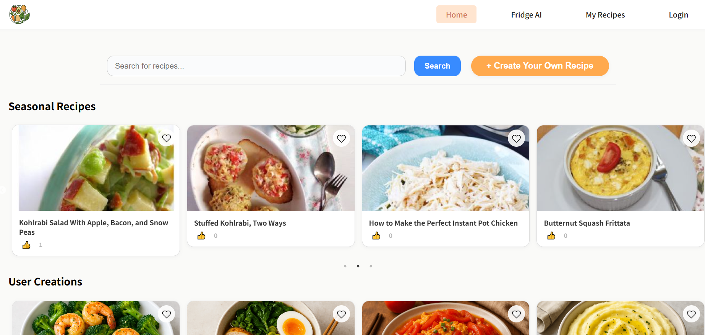
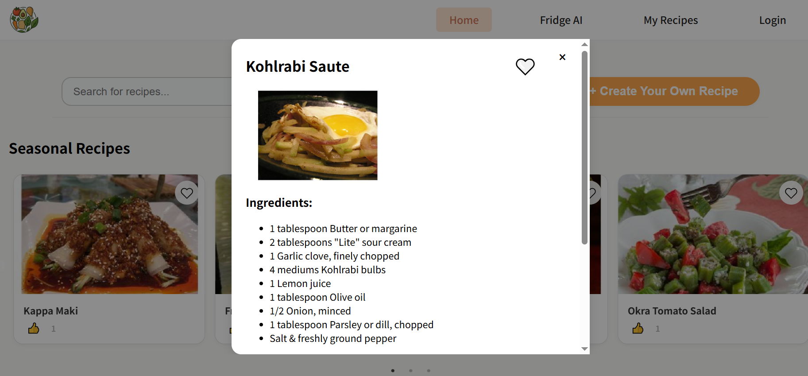
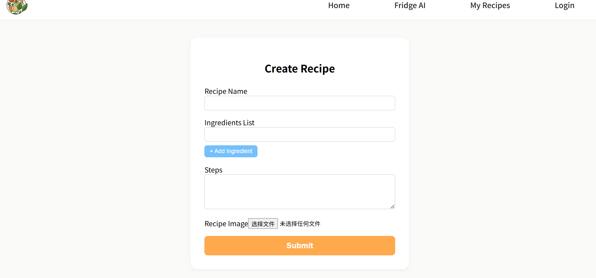
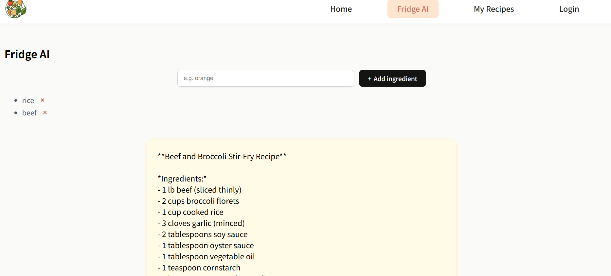
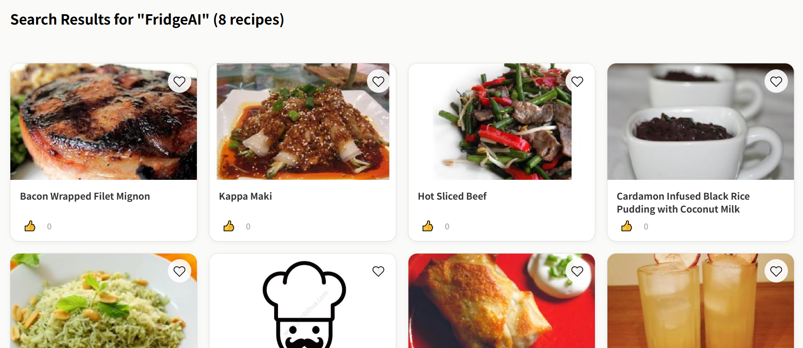
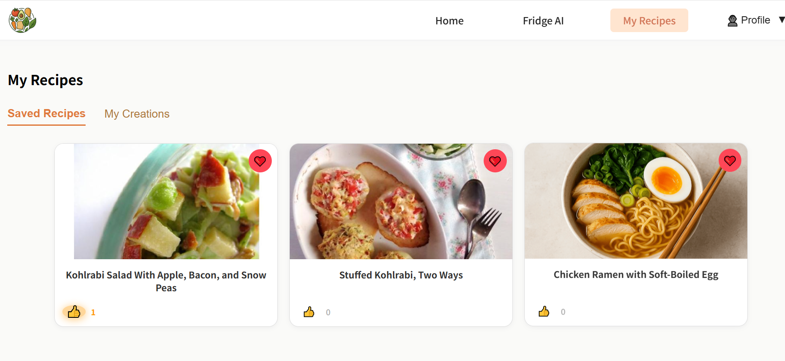
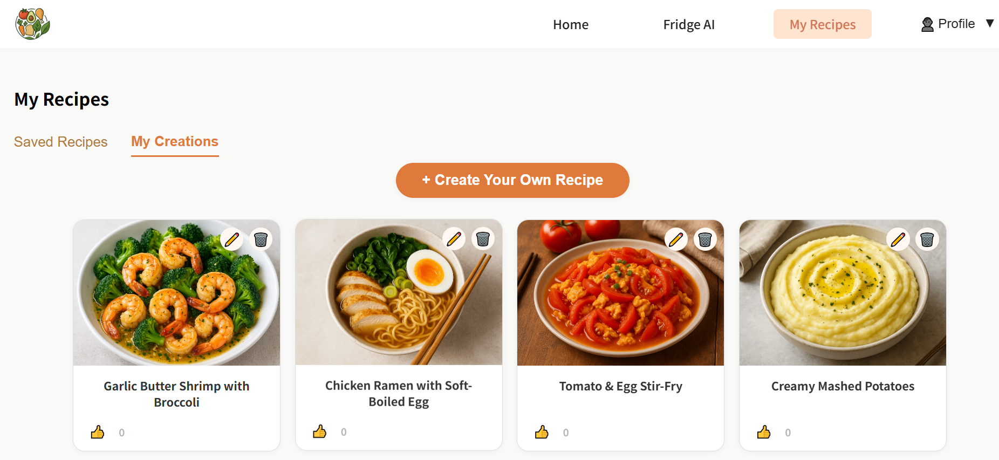
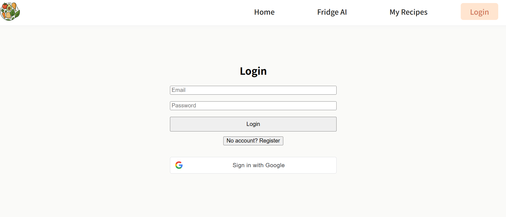

# 🍳 ChefHelper

> Your AI-powered sous-chef: discover, create, and cook smarter!

---

## 🚀 Tech Stack

- **Frontend:** React 19, Vite, React Router, Google OAuth, React Toastify, React Slick
- **Backend:** ASP.NET Core 8, MongoDB, JWT Auth, Cloudinary, DotNetEnv, Swagger
- **AI:** OpenAI GPT-3.5-turbo (ingredient-to-recipe magic)
- **APIs:** Spoonacular (recipe data)
- **Cloud:** Cloudinary (image storage), AWS
- **DevOps:** Docker, docker-compose, Github Action

---

## 🌟 Features (by App Page)

### 🏠 Home
- **Seasonal Recipe Carousel:**
  - Get timely, location-based seasonal recipe recommendations right on the homepage!
  - Uses your browser's location and local time to personalize seasonal picks—just like a real chef who knows what's fresh in your area!
- **Search Recipes:**
  - Search and filter thousands of recipes from Spoonacular.
- **Create Your Own Recipe:**
  - Publish your own culinary creations with image upload (Cloudinary).
- **User Creations Showcase:**
  - Browse recipes created by the ChefHelper community.
- **Like & Favorite:**
  - Like and favorite any recipe you love for easy access later.

### 🧊 Fridge AI
- **Ingredient-to-Recipe AI:**
  - Add your fridge ingredients and let AI (GPT-3.5-turbo) generate a creative recipe just for you!
- **Spoonacular Recommendations:**
  - Get instant recipe suggestions from the Spoonacular API based on your ingredients.

### 📚 My Recipes
- **My Favorites:**
  - View and manage all recipes you’ve favorited.
- **My Creations:**
  - See, edit, or delete all recipes you’ve published.

### 👤 Login & Register
- **Email Registration & Login:**
  - Secure JWT-based authentication for all users.
- **Google One-Click Login:**
  - Sign in instantly with your Google account.

---

## 🖼️ Screenshots

### 🏠 Home

*Seasonal recipe carousel and quick search.*

### 🔍 Recipe Detail

*Full recipe details, ingredients, and instructions.*

### 📝 Create Recipe

*Publish your own culinary creation with image upload.*

### 🧊 Fridge AI

*Enter fridge ingredients for AI suggestions.*


*See both AI-generated and Spoonacular-recommended recipes.*

### 📚 My Recipes

*All your favorited recipes in one place.*


*Manage recipes you have published.*

### 👤 Login / Profile

*Login, register, and manage your profile.*

---

## 🛠️ Installation & Local Development

### Prerequisites
- Node.js & npm
- .NET 8 SDK
- MongoDB (local or cloud)

### 1. Clone the repo
```bash
git clone https://github.com/your-username/ChefHelper.git
cd ChefHelper
```

### 2. Setup Backend
```bash
cd ChefBackend
# Restore dependencies
dotnet restore
# Configure your .env (MongoDB, OpenAI, Spoonacular, Cloudinary keys)
# Run the backend
dotnet watch run
```

### 3. Setup Frontend
```bash
cd ../ChefFrontend
npm install
# Configure API endpoint in src/services/recipesServices.js
npm run dev
```

### 4. Docker (optional)
```bash
docker-compose up --build
```

---

## 🌐 Live Demo

> [Try it!](https://chefhelper.art/) 

---

## ✨ Highlights & What I Learned

- **AI + Food:** Seamlessly integrated OpenAI GPT-3.5-turbo for creative, ingredient-based recipe generation.
- **API Mashup:** Combined Spoonacular’s massive recipe database with user-generated content.
- **Cloud Storage:** Used Cloudinary for robust, scalable image uploads.
- **Modern Auth:** JWT + Google OAuth for secure, user-friendly login.
- **Fullstack DevOps:** Dockerized, CI/CD, and deployed on Render for a true cloud-native experience.
- **Frontend Polish:** Responsive, mobile-friendly UI with React, Vite, and slick carousels.
- **API Design:** Designed RESTful endpoints for clean frontend-backend separation.
- **Learned:** OAuth, CORS, cloud deployment, AI API integration, and the joy (and pain) of debugging fullstack apps!

---

## 📬 Contact

Feel free to reach out for feedback, collaboration, or just to talk food & code!

---

> _Bon appétit & happy coding!_